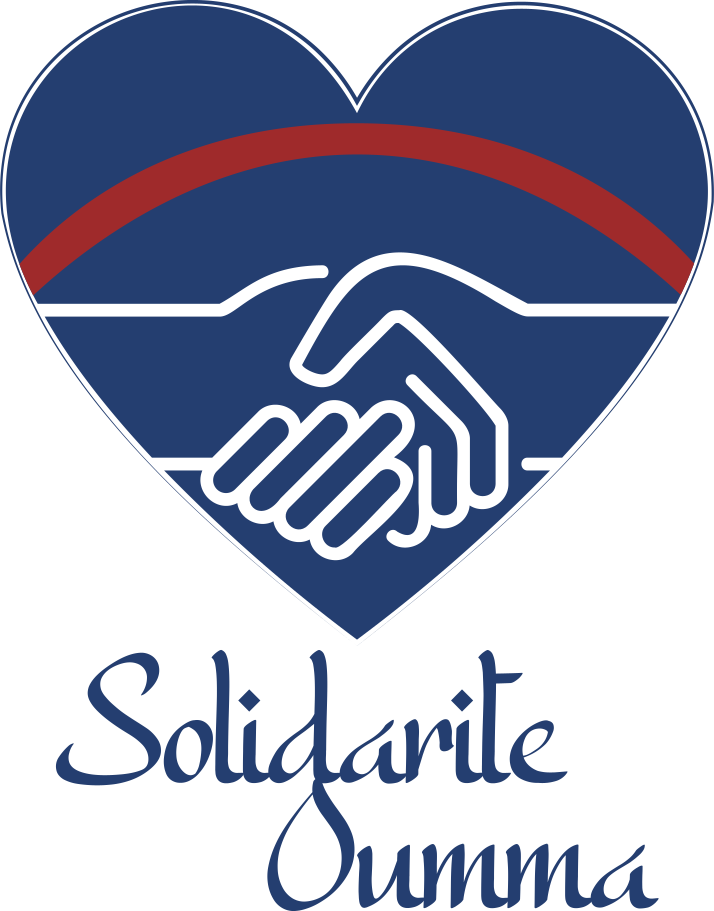

<p align="center">
    <picture>
        <source media="(prefers-color-scheme: dark)" srcset="ressources/logo/logo-mono-nooutline-white.svg">
        
    </picture>
</div>
 
 
# Bienvenue !
Vous retrouverez ici le code source de notre site Solidarité Oumma !

Vous pourrez également contribuer à l'améliorer si vous le souhaitez en créant des tickets de bugs ou bien de coder directement !

# Nuxt Docs

Look at the [nuxt 3 documentation](https://v3.nuxtjs.org) to learn more.

## Setup

Make sure to install the dependencies:

```bash
# yarn
yarn install

# npm
npm install

# pnpm
pnpm install --shamefully-hoist
```

## Development Server

Start the development server on http://localhost:3000

```bash
npm run dev
```

## Production

Build the application for production:

```bash
npm run build
```

Locally preview production build:

```bash
npm run preview
```

Checkout the [deployment documentation](https://v3.nuxtjs.org/guide/deploy/presets) for more information.
